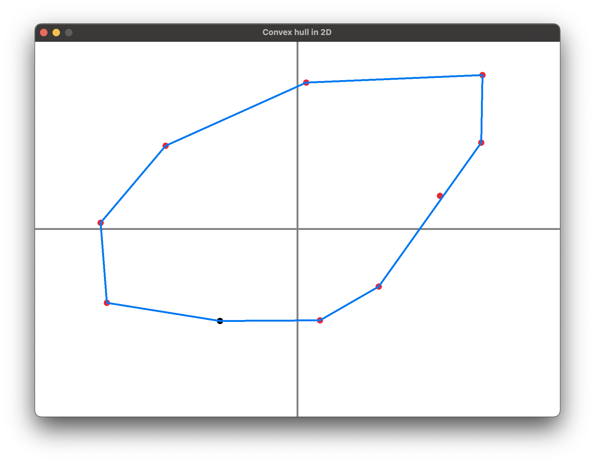

go-convexhull
=============

Implementation of Graham Scan in GO with visualization



Building (OSX)
========
Ensure that GO is installed. I'm assuming you're using ```brew``` in OSX.

**Install GLEW**
```
brew install glew

pkg-config glew --cflags --libs
//Keep a note of the include and libs for GLEW
```

**Compile & Install Go GL**
```
cd ~/go/src/github.com
git clone https://github.com/go-gl/gl.git
cd go-gl/gl

CGO_CFLAGS="-I/usr/local/Cellar/glew/1.11.0/include/" CGO_LDFLAGS="-L/usr/local/Cellar/glew/1.11.0/lib" go install
```

**Build and Run go-convexhull**
```
cd go-convexhull
go get
go get ./convexhull
go run convexhull.go
```
